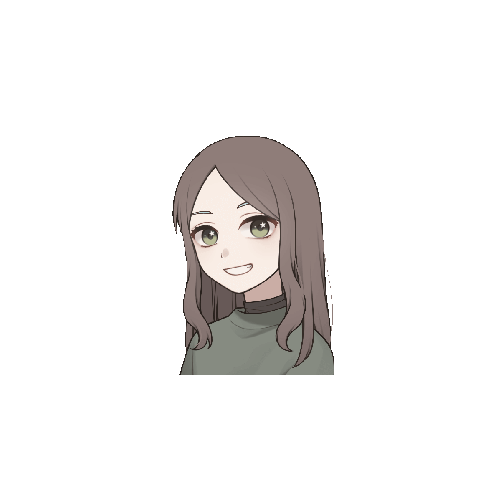

# 

🔭 I’m working on a range of projects, from developing a custom RISC-V SoC on FPGA to building scalable Full-stack software solutions.

🌱 I’m currently learning: Digital Systems Design, Applied AI & Machine Learning and advanced Web Architectures.
##

  
  
  

&nbsp;&nbsp;&nbsp;

  
  &nbsp;
  
  &nbsp;
  
  &nbsp;
  
  &nbsp;
  
  &nbsp;
  
  &nbsp;
  
  &nbsp;
  
  &nbsp;
  
  &nbsp;
  
  &nbsp;
  
  &nbsp;
  
  &nbsp;
  
  &nbsp;

##

<picture align="center">
  <source media="(prefers-color-scheme: dark)" srcset="https://raw.githubusercontent.com/mariaclararo/mariaclararo/output/github-contribution-grid-snake-dark.svg">
  <source media="(prefers-color-scheme: light)" srcset="https://raw.githubusercontent.com/mariaclararo/mariaclararo/output/github-contribution-grid-snake-dark.svg">
  
</picture>
